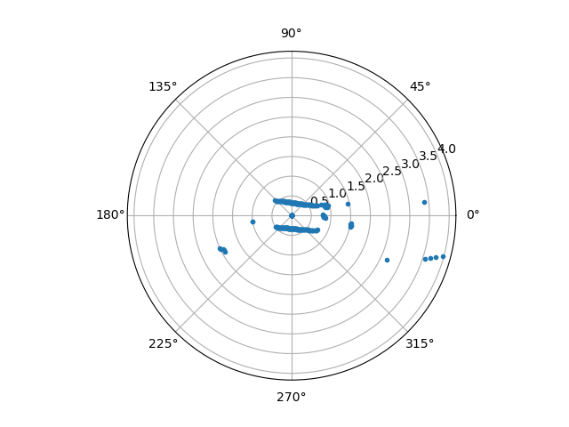

## Autonomous Vehicles and Artificial Intelligence
# Assignment 5 Localization of the Cones
Daniele Belmonte, Lars Alexander Paul Buck, Daniel Laurenz
Karl-Heinz Gerdes, Christof Hermeth, Liang Zhao

## 1. Introduction
One important function of an autonomous robot is localizing objects of interests in the environment. For the task of autonomously driving a Turtlebot, the objects of interests are paper cones of different colors.

The Turtlebot is equiped with a RGB mono camera, which is capable of recognizing the paper cones and classifying them based on color with our objective detection algorithm. However, the mono camera cannot provide depth information, therefore a direct measurement of the distance between the detected cone and the robot was not possible with only the camera input.

A lidar sensor measures the distance directly, and the Turtlebot is equiped with a 360 degrees single line lidar. The main limitation of this sensor is the amount of information that it can provide. The lidar has very limited resoluation in the vertical direction, i.e. only a single point at each measurement location. Thus it can hardly provide sufficient information for the object detection task. Besides, the lidar cannot provide any color information, meaning it has no chance to distinguish cones of different colors.

The solution to this localization problem is to combine the information from both the camera and the lidar, also known as sensor fusion.


## 2. Accessing Lidar
The first step of implementing sensor fusion is getting access to both sensors. Here we focus on accessing the lidar since accessing the camera and conducting object detection based on camera input have already been done in the previous assignments.

The Turtlebot has a built-in puslisher for the lidar, which is included in the bringup package. 

```
ros2 launch turtlebot3_bringup robot.launch.py
```

The publisher send out lidar readings on the topic `\scan`, with a special message type `sensor_msgs.msg.LaserScan`. A corresponding subscriber was created in the node that needs to access the lidar as follows. It is also worth mentioning that the QOS profile of the subscriber must be set to `rclpy.qos.qos_profile_sensor_data` in order for the subscriber to function properly.

```python
from sensor_msgs.msg import LaserScan
from rclpy.qos import qos_profile_sensor_data

self.laser_subscription = self.create_subscription(
    LaserScan,                  # msg type
    '/scan',                    # topic name
    self.updateLidarData,       # callback function
    qos_profile_sensor_data,    # qos profile
)
```

The `LaserScan` message contains various infomation regarding the lidar, such as the starting and ending angles, the maximum and minimum ranges. The most important one among them is `LaserScan.range`, which contains the measured distances at each point. The lidar on the turtlebot has an angle resolution of 1 degree, thus the `LaserScan.range` is a list with length 360 corresponding to a full rotation, each element is a float number representing the distance in meters. We have tested the functionality of lidar by visualizing the ranges when placing the robot in various environments. One of such visualization is shown below.

<figure>
    
    <figcaption>The lidar ranges when the robot was placed between 2 flat vertical surface. 
    </figcaption>
</figure>

It should also be noted that the lidar returns `0` values when "out of range", i.e. the distance is larger than the maximum range of the lidar. Therefore, all ranges with `0` values are discarded.

We have identified the orientation of the lidar sensor from these experiments. The `0` degree is pointing at the rear of the robot, and the `180` degree corresponds to the front direction.

## 3. Aligning Lidar and Camera 
The next step towards sensor fusion is aligning the lidar and the camera, which would enable us to map the relevant lidar measurements to the pixel location on the camera images.

The lidar and the camera on the Turtlebot have very different FOVs (field of view). The lidar has 360 degrees FOV due to its rotating nature, while the camera has 62 degrees FOV in the horizontal direction. For the purpose of sensor fusion, it is sufficient to discard the lidar measurements outside of the camera FOV. Thus, only the lidar ranges within the range of $[180 - 62/2, 180 + 62/2] = [149, 211]$ degrees are used in the later steps.

Generally, the lidar and the camera of the Turtlebot are not perfectly aligned due to manufacturing and asssembling tolerances. For example, the `180` degree direction of the lidar and the center of the camera image are not exactly aligned. A calibration was conducted to check alignment and to make corrections.

We started with a simple linear projection from the lidar range to pixel position. The lidar ranges are placed along the horizontal direction of the camera image at equal intervals. which is only an approximation, as the exact location of each lidar measurement point is dependent not only on the angle value, but also the distance (depth). However, we have found this approximation accurate enough for the purpose of measuring the distance between paper cones and the robot, mainly due to the very limited range  (3.5m maximum) and the low angular resolution (1 degree) of the lidar sensor.

We have visualized this projection by overlaying a visual representation of the lidar ranges on the camera footage. As shown in the figure below, each lidar measurement was represented as a dot and the vertical position of the dot represent the distance.

[a screen shoot goes here]

The alignment can be checked visually when placing the robot in front of calibration targets with streight vertical edges. A laptop with its screen set to 90 degree position was used as the calibration target, as shown in the figure below. The laptop was placed at various horizontal positions as well as various distances to check the alignment.

[one or two screen shoots]

We have found only small misalignment with the aforementioned overlay method. A small offset value was added to the horizontal position of lidar measurement points and satisfactory alignment was achieved.

## Distance to Cones

To determine the distance to a detected cone, the xmin and xmax values are used, to make up a horizontal space, where the cone is in. This space is then filtered for the minimum lidar value (excluding 0) to determine the nearest point.

As the angles are linearly spaced to the pixels each x value can be converted in an angle by calculating:  
$angle = \frac{62}{640} * x$
